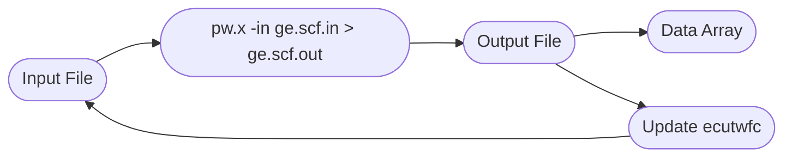

# Problem 1: Convergence of Absolute Energies with Respect to Cutoff Energies

A. Using Quantum Espresso PWscf, calculate the energy of Ge in the diamond structure as a function of palne-wave cutoff energy. A good range to try is 5-80 Ry, doing calculations at increments of 5 Ry, keeping other variables constant. Record and plot final results. Specify when you reach the level of convewrgence of aorund 5 meV/atom. Note that the code calculates energy per primitive cell (not atom). 

B. Do you see a trend in your calculated energies and calculation time with respect to the cutoff? Is this what you expect and why? 

C. Cubic unit cell vs primitive cell. Advantages and disadvantages of both?

## Background Information

This problem allows for the use of two main ideas
- Setting up a standard SCF calculation in quantum espresso for a specified structure (and get the absolute energy).
- Scripting to automate the changing/iteration of the cut off energies. This we can do in python to generate the input files and call `pw.x` via command line tools in python. 

When we perform a SCF calculation, we have many parameters that we can tune, one of which being the plane-wave cut off as we truncate our sum over plane waves for numerical calculations. As we increase the energy cut off, we'd expect our results to converge closer to the converged value. 


## Input File

The core of each PW scf calculation starts with an input file that we can call `ge.scf.in` for our case of a scf calculation for Ge. To run this calculation, we would call `pw.x -in ge.scf.in > ge.scf.out` where `ge.scf.out` is the output file (assuming that `pw.x` is in our path). In particular, the input file that we use will look like 
```
&control
    calculation = 'scf' 
    prefix = 'Germanium',
    pseudo_dir = '/Users/vinhtran/Documents/GitHub/DFT/First_Principles_Energy_Methods/Problem_1',
    outdir = '.',
/
&system
    ibrav = 2,
    celldm(1) = 10.690181,
    nat = 2,
    ntyp = 1,
    ecutwfc = 80.0,
/
&electrons
/
ATOMIC_SPECIES
 Ge 72.64 ge_pbe_v1.4.uspp.F.UPF
ATOMIC_POSITIONS
 Ge 0.00 0.00 0.00
 Ge 0.25 0.25 0.25
K_POINTS automatic
 8 8 8 0 0 0

```
There are many parameters and things to consider and explanations can be found in the quantum espresso pw input file documentation. Relevant for us though is `ecutwfc` which specifies the cut off energy in Ry. So if we were to run this program for this specific input file, we would be able to get the total energy for a cut off energy of 80.0 Ry. Then in principle, we could simply change this value in the input file and manually call `pw.x -in ge.scf.in > ge.scf.out` each time and record the subsequent energy value. However, this becomes tedious. There is a better way! 

There are many ways to do this: such as running a shell script or using TCL scripts. Likewise though, we can do this in Python, and in particular use a Jupyter notebook which allows a convenient interface for plotting. 



## Python Scripting in Jupyter 


## Results 


